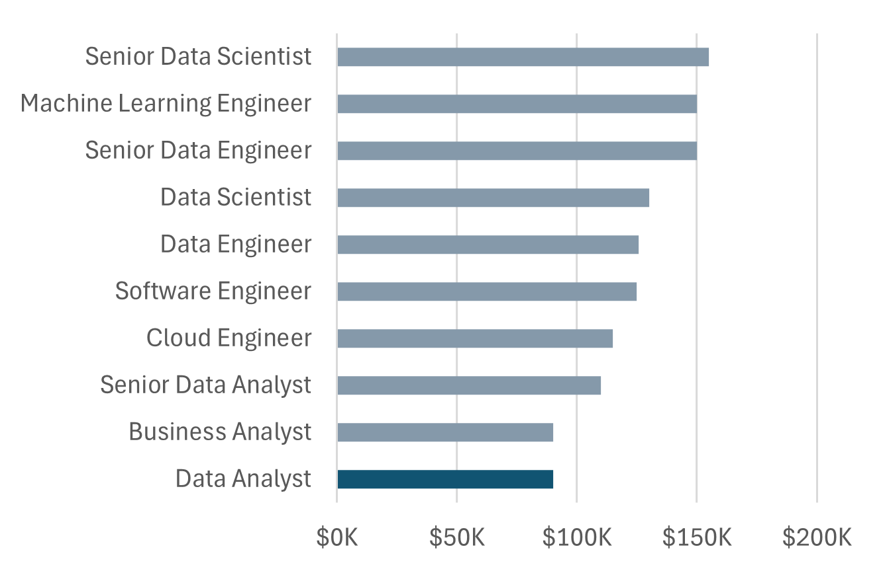
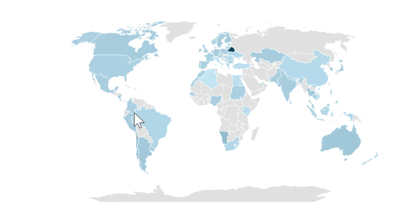
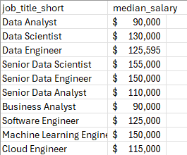
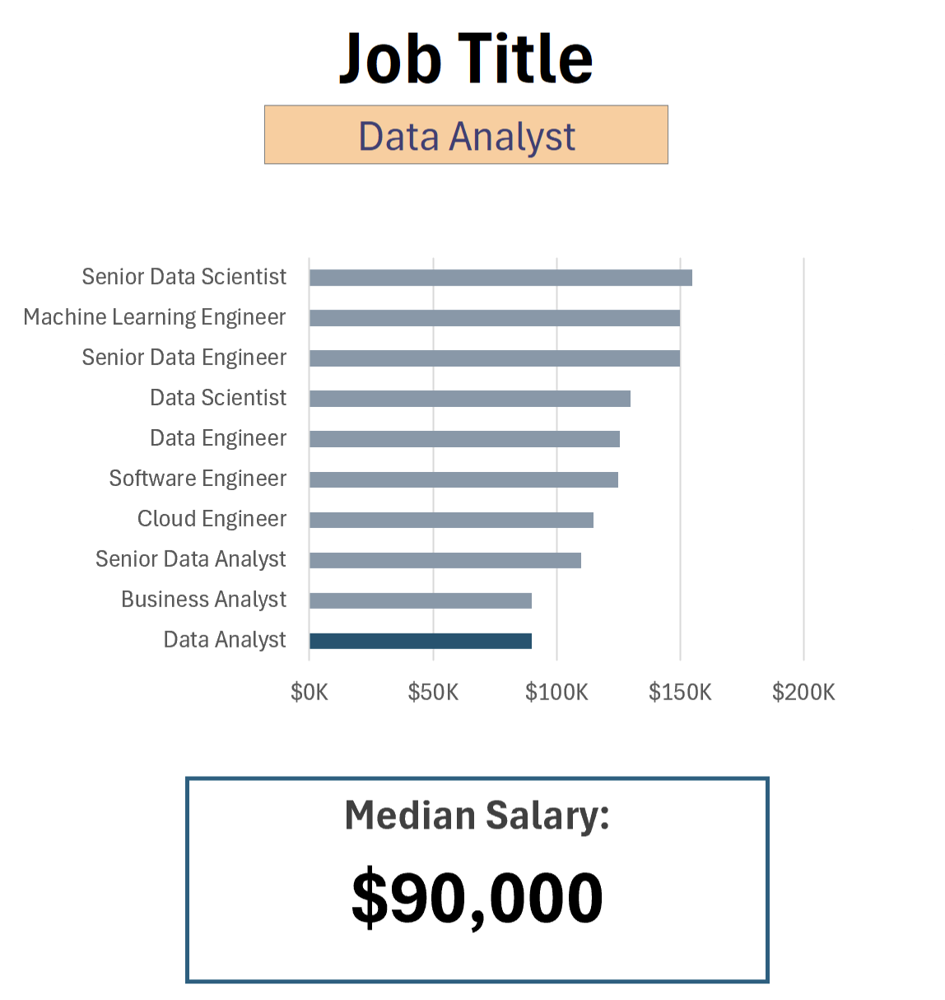
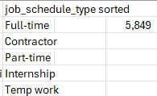

# Excel Salary Dashboard

## Introduction

This interactive dashboard helps job seekers explore salary data across 
data-related roles, filtering by job title, country, and employment type 
to quickly benchmark compensation.

Built while completing Luke Barousse's free "Excel for Data Analytics" 
course, using the real-world 2023 data science job dataset provided as 
part of the course.

### Dashboard File
[1_Salary_Dashboard.xlsx](1_Salary_Dashboard.xlsx)

### Excel Skills Used
- 📉 Charts
- 🧮 Formulas and Functions
- ❎ Data Validation

## Dashboard Build

### 📊 Data Science Job Salaries — Bar Chart

- Horizontal bar chart comparing median salary across job titles, sorted 
  descending for readability.
- Salary values formatted as currency directly on the chart labels.

### 🗺️ Country Median Salaries — Map Chart

- Excel's built-in map chart plotting median salary by country.
- Color-coded scale to visually compare compensation across regions.

### 🧮 Median Salary by Job Title (Formula)
=MEDIAN(
IF(
(jobs[job_title_short]=A2)*
(jobs[job_country]=country)*
(ISNUMBER(SEARCH(type,jobs[job_schedule_type])))*
(jobs[salary_year_avg]<>0),
jobs[salary_year_avg]
)
)
- Array formula filtering by job title, country, and schedule type, 
  excluding blank salaries.

### ⏰ Unique List of Job Schedule Types (Formula)
=FILTER(J2#,(NOT(ISNUMBER(SEARCH("and",J2#))+ISNUMBER(SEARCH(",",J2#))))*(J2#<>0))
- Generates a clean, deduplicated list of schedule types for use in the 
  data validation dropdown.

### ❎ Data Validation

- Applied the filtered lists above as dropdown validation rules for 
  Job Title, Country, and Type — restricting user input to valid options 
  and keeping the dashboard reliable.
