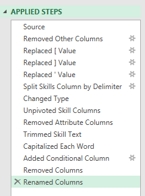
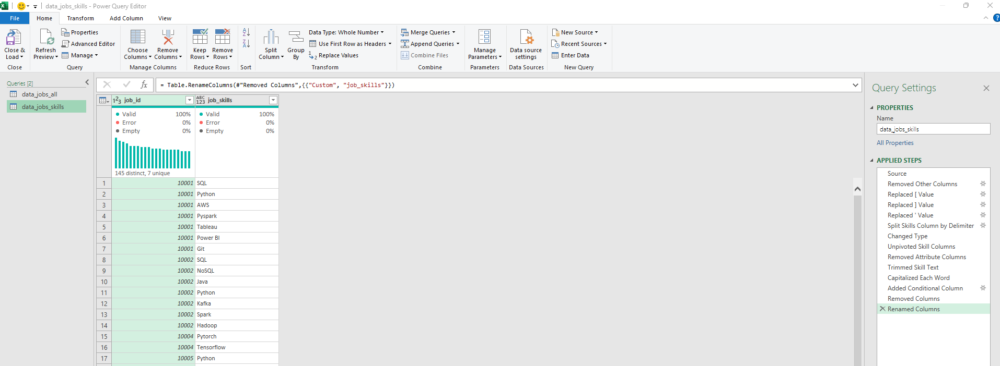
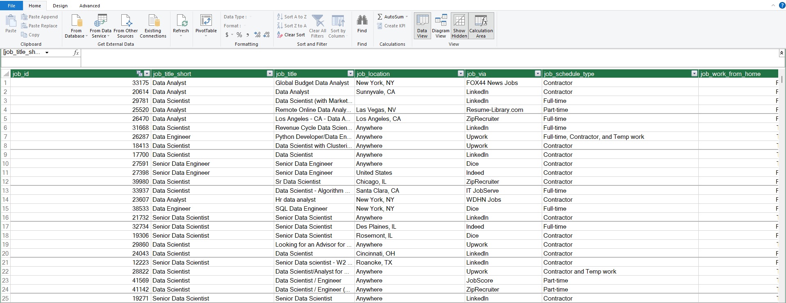
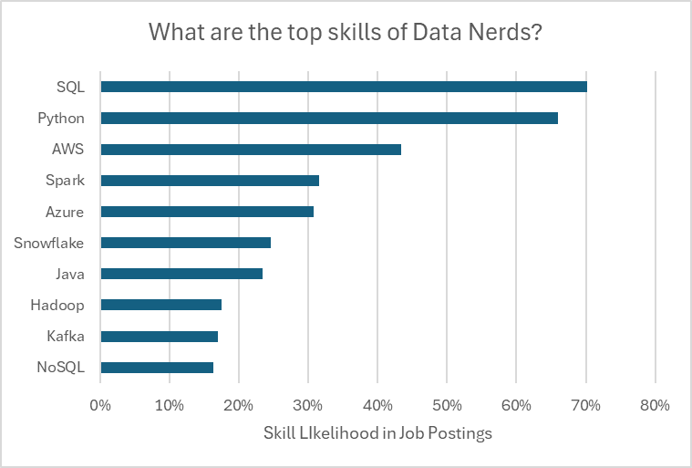

# Project 2 — Data Analysis

## Introduction

This project explores the data science job market to answer questions 
useful for job seekers: which skills correlate with higher pay, how 
salaries vary by region, and which skills are most in demand.

Completed while following Luke Barousse's free "Excel for Data Analytics" 
course. The dataset (real-world data science job postings from 2023) is 
provided as part of the course.

### Questions Analyzed
1. Do more skills get you better pay?
2. What's the salary for data jobs in different regions?
3. What are the top skills of data professionals?
4. What's the pay for the top 10 skills?

### Excel Skills Used
- 📊 Pivot Tables & Pivot Charts
- 🧮 DAX (Data Analysis Expressions)
- 🔍 Power Query
- 💪 Power Pivot

## 1️⃣ Do more skills get you better pay?

Built a Power Query ETL pipeline extracting job and skills data into two 
related tables:

Loaded both transformed queries into the workbook:

**Finding:** roles requesting more skills (e.g. Senior Data Engineer, 
Data Scientist) tend to command higher median salaries than roles 
requesting fewer skills (e.g. Business Analyst).

## 2️⃣ Salary by region

Built a PivotTable on the Data Model with a custom DAX measure:
Median Salary US := CALCULATE(
MEDIAN(data_jobs_all[salary_year_avg]),
data_jobs_all[job_country] = "United States")

## 3️⃣ Top skills

Built a relationship model in Power Pivot connecting job postings to 
requested skills via `job_id`:

SQL and Python dominate as the most requested skills overall, with cloud 
platforms (AWS, Azure) showing strong presence.

## 4️⃣ Pay by top 10 skills

Built a combo PivotChart (clustered column for median salary, line for 
skill likelihood %) to compare pay against demand for the top 10 skills.

## Chart–Slicer Connection Fix

One challenge: my final chart used a scatter plot, which Excel doesn't 
support as a native PivotChart, so it didn't respond to slicers 
automatically. I solved this by linking the chart's source cells to 
the PivotTable using INDEX/MATCH formulas (returning `#N/A` for filtered-out 
rows so points cleanly disappear), so the chart now updates live with the 
slicer.

## Conclusion

This project let me practice the full Excel data analytics toolkit — 
Power Query, Power Pivot, DAX, and PivotCharts — while solving a real 
compatibility issue between scatter charts and slicers.
